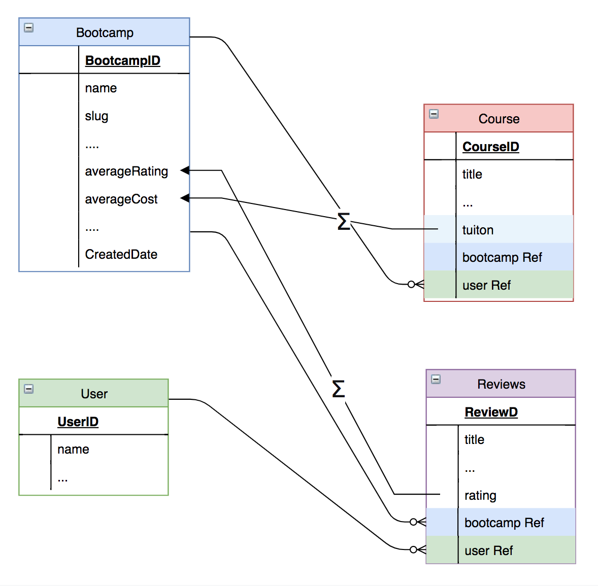

# Bootcamp-aggregator-api

## Contents
- [Bootcamp-aggregator-api](#bootcamp-aggregator-api)
  - [Contents](#contents)
  - [Introduction](#introduction)
  - [Used technology](#used-technology)
  - [Database Schema](#database-schema)
    - [Database Schema Visalization](#database-schema-visalization)
    - [Resource types and their special properties](#resource-types-and-their-special-properties)
      - [Bootcamps](#bootcamps)
      - [Reviews](#reviews)
  - [Usage](#usage)
  - [Install Dependencies](#install-dependencies)
  - [Run app](#run-app)
  - [Example database seeder](#example-database-seeder)
  - [Example API Request instructions](#example-api-request-instructions)
    - [Get All Bootcamps](#get-all-bootcamps)
      - [Descripiton of Parameters](#descripiton-of-parameters)
      - [Example usage](#example-usage)

## Introduction
[Bootcamp-aggregator-api](https://github.com/moritzWa/bootcamp_aggregator_api) is an application to aggregate and review bootcamps. This document describes the technologies its build on, how to configure and run the application, it's database schema, those particularities and it's main functionality by an example API request instructions. 

## Used technology
The application is build with [Node.js](https://nodejs.org/en/), the [Express](https://expressjs.com/) framework and uses MongoDB as a Database. It also utilizes [Mongoose](https://mongoosejs.com/) to verify the database operation.

## Database Schema
The database schemas resources are:
- Bootcamps
- Course
- Review
- User

### Database Schema Visalization

[view in draw.io](https://drive.google.com/file/d/1pzYtUmUjFr9HIVLz4ZO8bSnHZb3LwebA/view?usp=sharing)

### Resource types and their special properties

#### Bootcamps
 Bootcamps have a slug that is created with the package [slugify](https://www.npmjs.com/package/slugify). This slug can be used to display the Bootcamp's url as a path in a frontend application. It is computed before the creation of the Bootcamp using [Middleware](https://mongoosejs.com/docs/middleware.html). 

#### Reviews
A function in the ReviewModel enforces the constraint that each user can only create one review per Bootcamp by a [compound index](https://docs.mongodb.com/manual/core/index-compound/) of the User and Bootcamp collections.

## Usage

Rename "config/config.env.env" to "config/config.env" and update the values/settings to your own

## Install Dependencies

```
npm i
```

## Run app

```
# Run in dev mode
npm run dev

# Run in prod mode
npm start
```

## Example database seeder

To seed the database with users, Bootcamps, Courses, and Reviews with exemplary data from the "\_data" folder, run

```
# Destroy all data
node seeder -d

# Import all data
node seeder -i
```

## Example API Request instructions


The documentation for this application's full interface can be found on [documenter.getpostman.com](https://documenter.getpostman.com/view/8480127/TVev44XM).

### Get All Bootcamps

This API-request is a get request that returns all document-instances of the Bootcamp entity in the database. It offers multiple params that can be used to define Bootcamp's exact types that should be returned. The functionality for the results of this API request is implemented in ```bootcamp_aggregator_api/middleware/advancedResults.js```.

```{{URL}}/api/v1/bootcamps?select=<Bootcamp-property1>&sort=[Bootcamp-property]&page=<page-number>&limit=<limit-number>&<Bootcamp-number-property>[<operator>]='<Bootcamp-number-propert>'```

#### Descripiton of Parameters

- ```select=[Bootcamp-property-n]```
  - Select the properties that you want to be shown in the query result. 
- ```sort=[Bootcamp-property]``
  - Select a property to sort for. 
- ```page=[page-number]```
  - Switsh between the pages of the API-request-return.
- ```limit=[page-numbr]```
  - Specify the number pages e.g. hom many Bootcamps the returns per request.
- ```[Bootcamp-number-property][[operator]]=[operator-target]```
  - Limit the request results to to a certain range using the [Comparison Query Operators](https://docs.mongodb.com/manual/reference/operator/query-comparison/): gt|gte|lt|lte|in 

#### Example usage 
For all available Bootcamps, 
- get the name, and if they offer housing, 
- sorted by the name of the city, 
- limited the shown results to two per page, 
- and only show those with a cost of less than or equal to (<=) 10,000$.

```{{URL}}/api/v1/bootcamps?select=housing,name&sort=city&limit=2&averageCost[lte]='10000'```